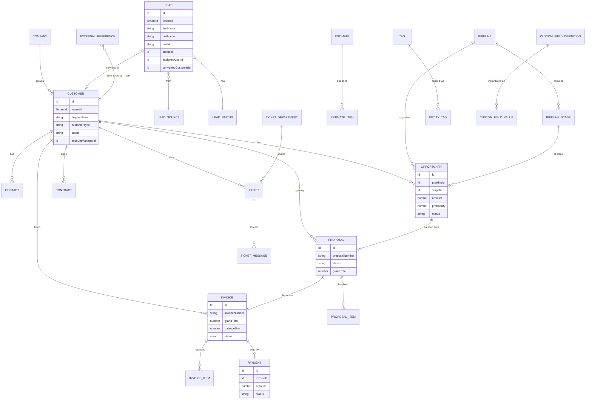
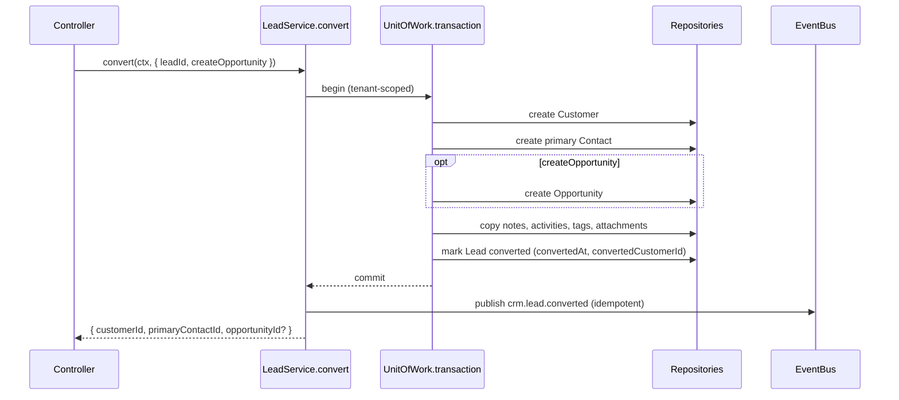
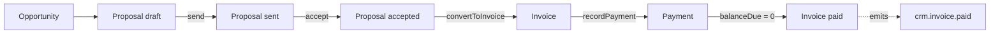
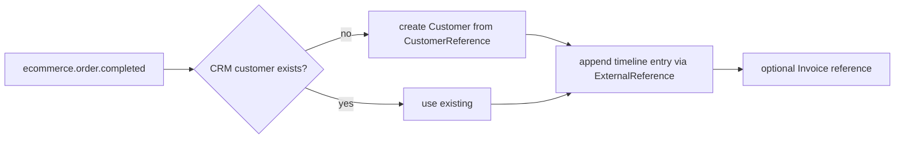

# CRM Core — Domain Model

**Status:** Phase 1. These are contracts (TypeScript interfaces in
`packages/crm-core/src/domain`). No persistence exists yet; the ERD is the target shape a
later phase migrates.

## Conventions

- **Identifiers:** ULID strings, branded as `Id` (`@platform/shared`).
- **Tenant:** every persisted record extends `CrmRecord` → carries `tenantId` +
  `createdAt` / `updatedAt` / `deletedAt` (soft delete).
- **Money:** amounts are numbers paired with an ISO-4217 `currency`; never a bare number
  where a currency is implied.
- **Polymorphic attachments:** activities, tasks, notes, tags, attachments, comments and
  custom-field values reference a target by `(entityType, entityId)` where `entityType` is
  a `CrmEntityType`.

## Entity relationships

Supporting tables not drawn above: `NOTE`, `COMMENT`, `ATTACHMENT`, `ACTIVITY`, `TASK`,
`EMAIL_LOG`, `COMMUNICATION_LOG`, `CRM_SETTINGS`, `AUDIT_LOG` — all polymorphic on
`(entityType, entityId)` and tenant-scoped.

## Aggregates and invariants

- **Lead** — an unqualified prospect. Converts (once) into a customer; `convertedAt` /
  `convertedCustomerId` are set atomically. Duplicate detection by email/phone before
  create.
- **Opportunity** — a revenue deal in a pipeline. Stage changes and won/lost transitions
  are authorized, server-validated use cases; `probability` defaults from the stage.
- **Proposal / Estimate / Invoice** — totals (`subtotal`, `discountTotal`, `taxTotal`,
  `grandTotal`, `balanceDue`) are computed server-side from line items, never trusted from
  the client. Line items reference external catalogs via
  `referenceType ∈ {ecommerce_product, rental_item, booking_service, custom_item}`.
- **Invoice** — may originate from a proposal or an external order
  (`orderReferenceType`/`orderReferenceId`); CRM stores the reference and owns none of the
  order's logic.
- **Payment** — recorded against an invoice; `metadata` must never hold sensitive payment
  data (masked before persistence).
- **Ticket** — support thread with messages, department routing and escalation.

## Lead conversion (transactional)

A single transaction; either all steps commit or none do.

## Proposal → payment flow

External orders join the same invoice flow without CRM re-implementing them:

